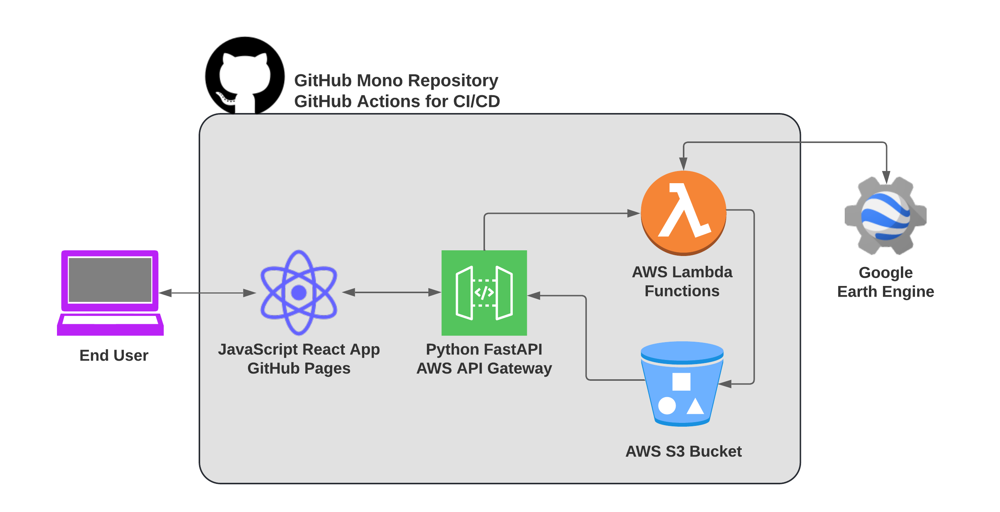

# planet-emu
A fullstack project that gathers, displays, models, and predicts soil, weather, and spectral features by spatial boundaries.

## GitHub Pages
[Click here](https://danmcfan.github.io/planet-emu) for the GitHub Pages frontend web application.

## Python FastAPI
[Click here](https://api.planet-emu.com/docs) for the Python FastAPI interactive documentation.

## Features
- Executes geospatial queries to Google Earth Engine using AWS Lambda Functions.
    - Gathers soil, weather, and spectral properties for county boundaries within the contiguous United States.
- Deploys a JavaScript React web application to GitHub Pages.
    - Displays the geospatial data as layers within a MapBox component.
- Creates a simple regression model using TensorFlow to predict the relationship between weather / soil and the normalized difference vegetation index (NDVI).

## Architecture

