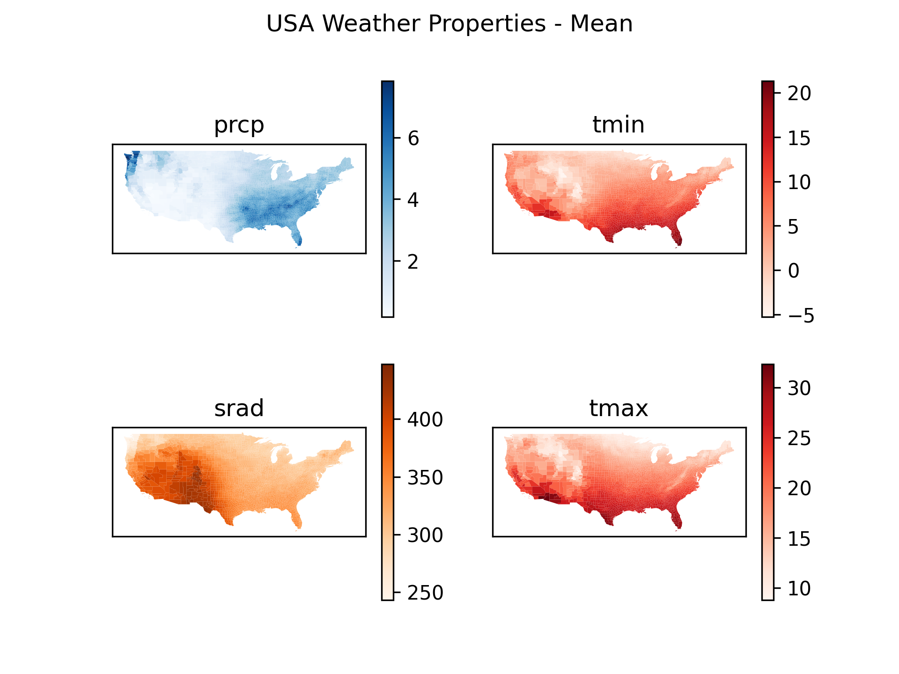
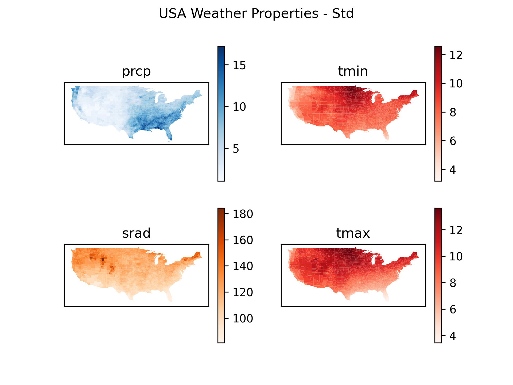
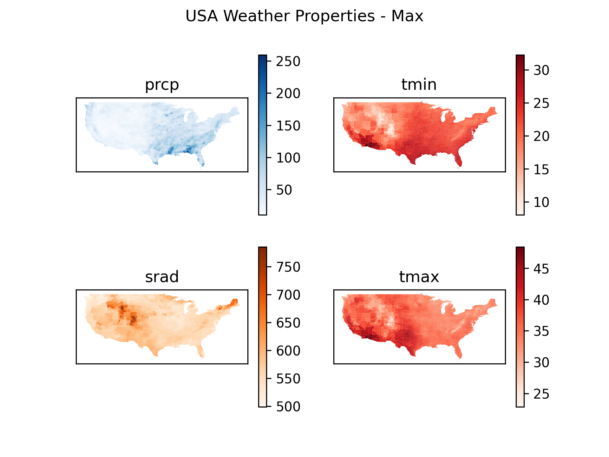
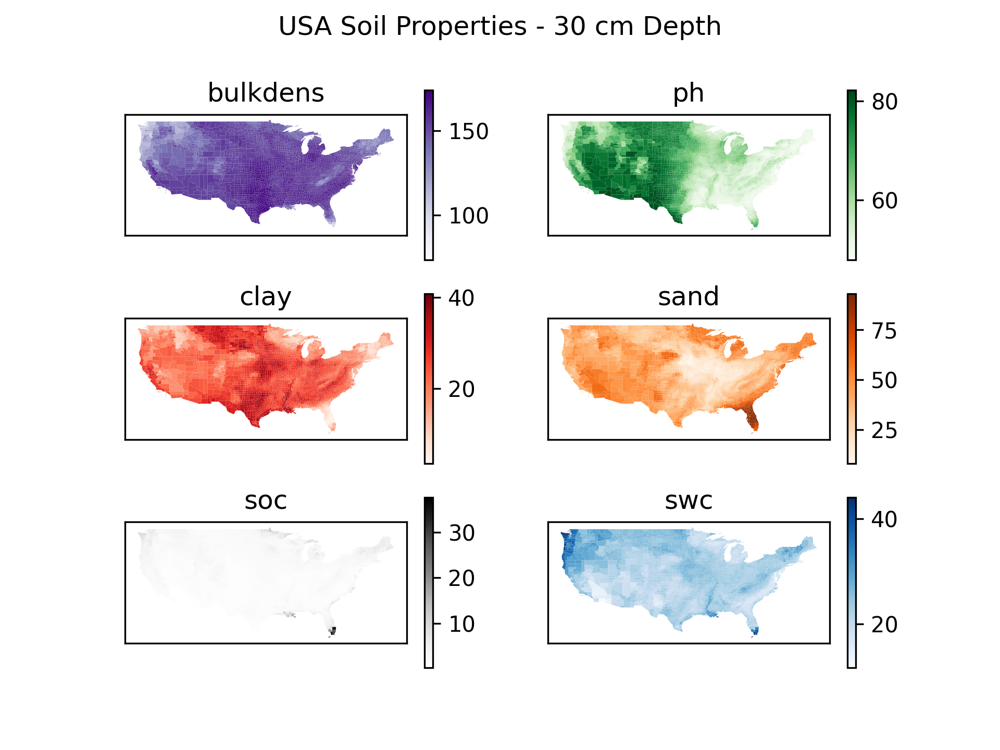
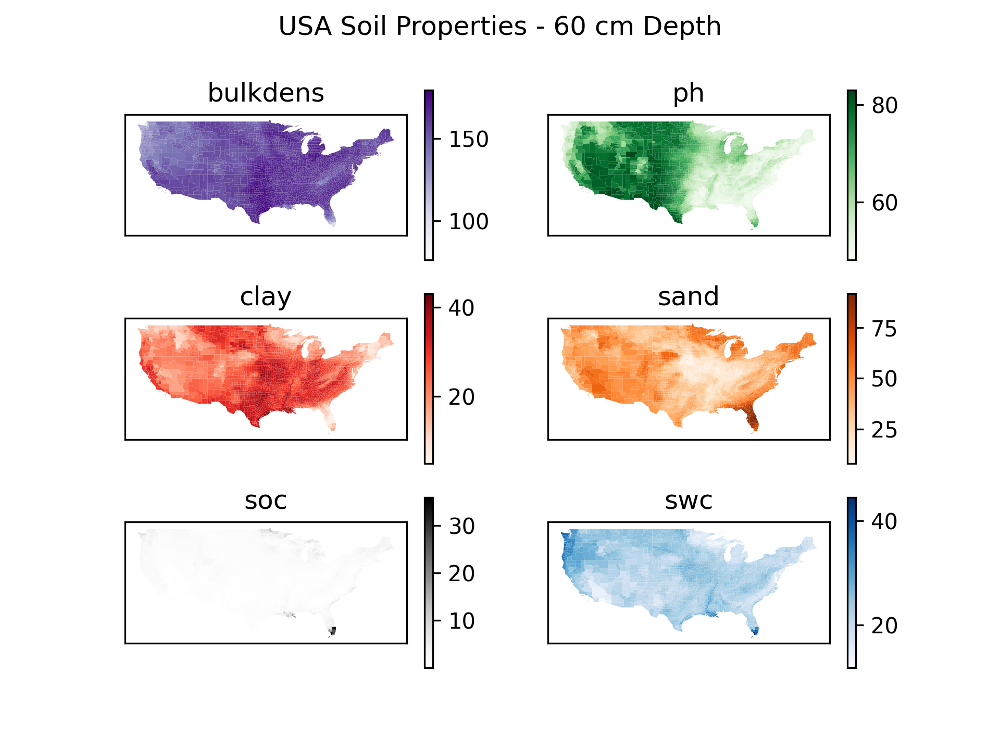
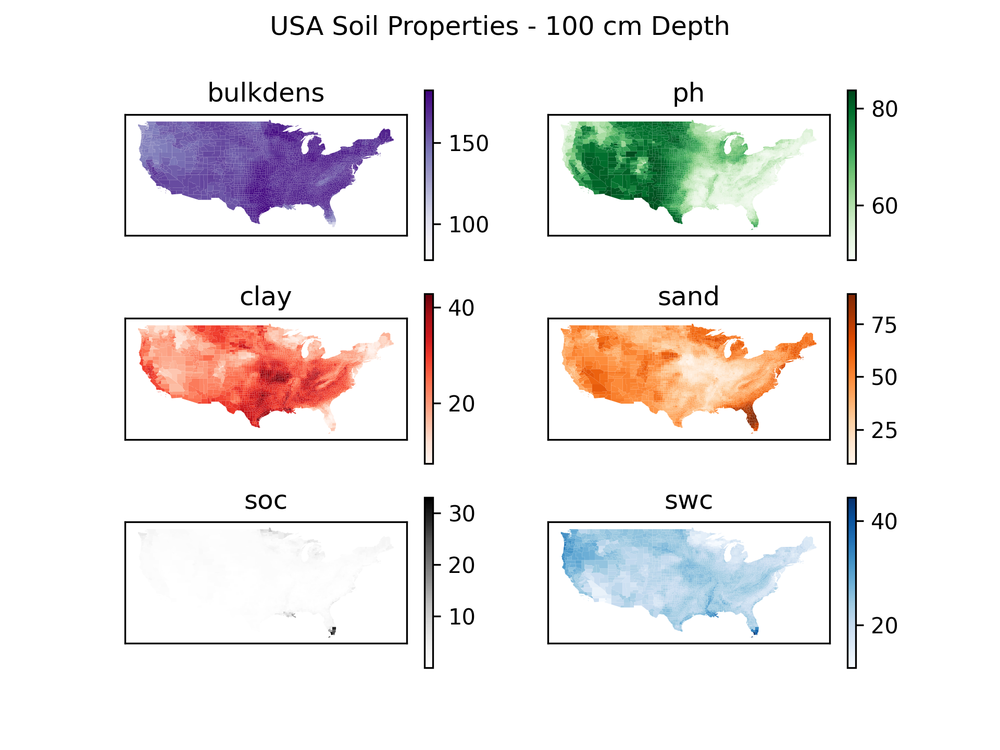
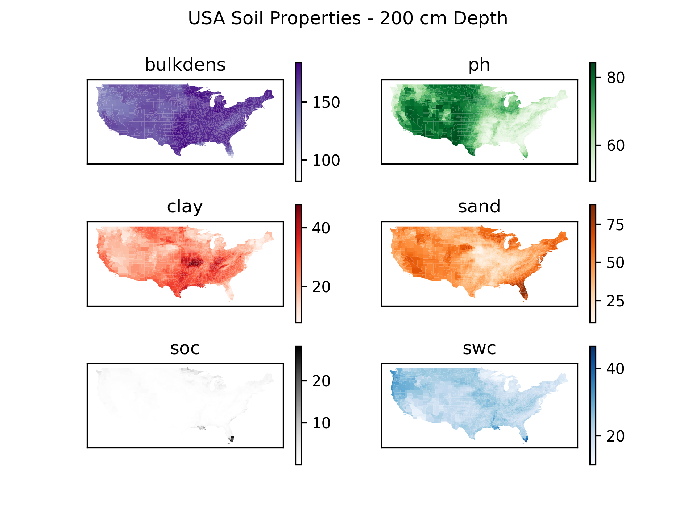

# planet-emu
A geospatial data processing library built using Google Earth Engine API for Python.

## Features
- Gathers soil and weather properties across the spatial boundary of the contiguous United States.
- Plots the spatial data into descriptive maps.

## Weather Properties

## Soil Properties

